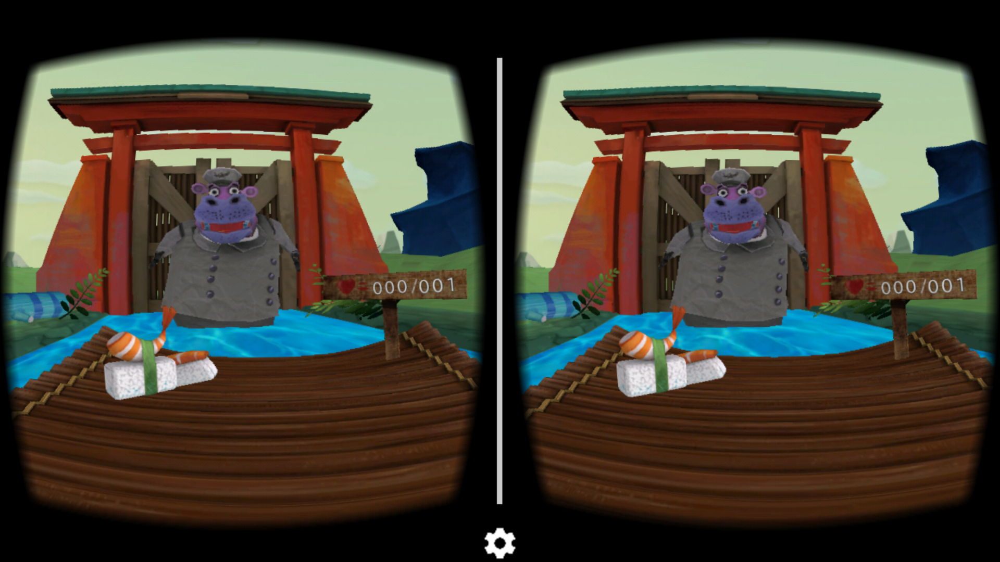
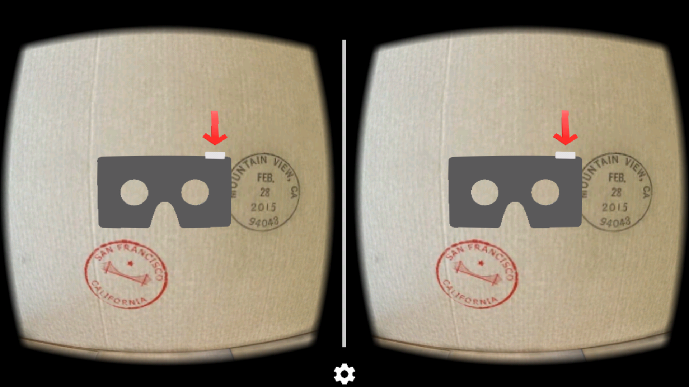
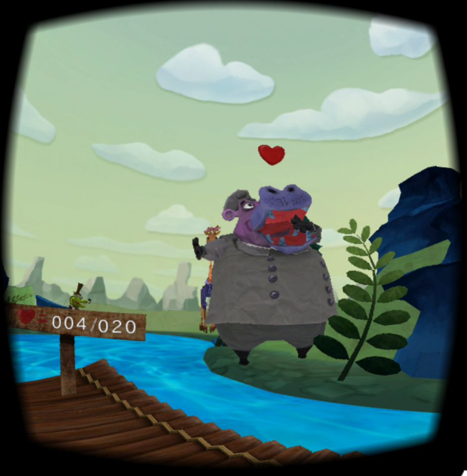

Cardboard Gameplay {#zooshi_guide_gameplay_cardboard}
==================

## Overview

In this mode, you control the game directly with [Google Cardboard][],
aiming at patrons just by looking at them and throwing sushi with
a flick of the switch.

Just like the standard game, the goal is to hurl sushi into the mouths of
as many animal patrons as you can. For each lap around the river, you will
notice the minimum number of patrons that you must feed will increase. You
must meet (or exceed) the lap quota in order for the gate to open for another
thrilling lap of sushi launching.

## Setup

To play in Cardboard mode, simply select "Cardboard" from the Zooshi menu.
You will then see an intermediate screen, which allows you to use the gear icon
to configure your Cardboard device and test the result.

Once you are ready to begin, simply insert your device into the Cardboard and
flick the switch to start the game. Alternatively, you can just touch the screen
to start, so you can still try it out, even without a Cardboard device.

## Controls

When the game starts, you will be right in the middle of the Zooshi action.
As you look around to aim, you can flick the switch to throw a sushi.

After the game ends, you can flick the switch again to start up a new game.
Otherwise, press the back button to go to the Zooshi menu.

*Note: You may need to swipe down from the top, or side, of your screen
in order to display the system navigation buttons for your device. This will
depend on your device. Please refer to your specific device's manual for more
information.*

Read more about how it works [here][].

 

  [Google Cardboard]: https://www.google.com/get/cardboard/
  [here]: @ref zooshi_guide_cardboard
